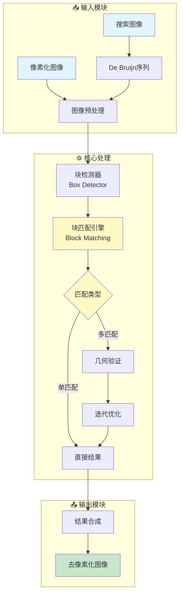
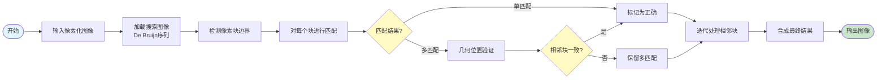
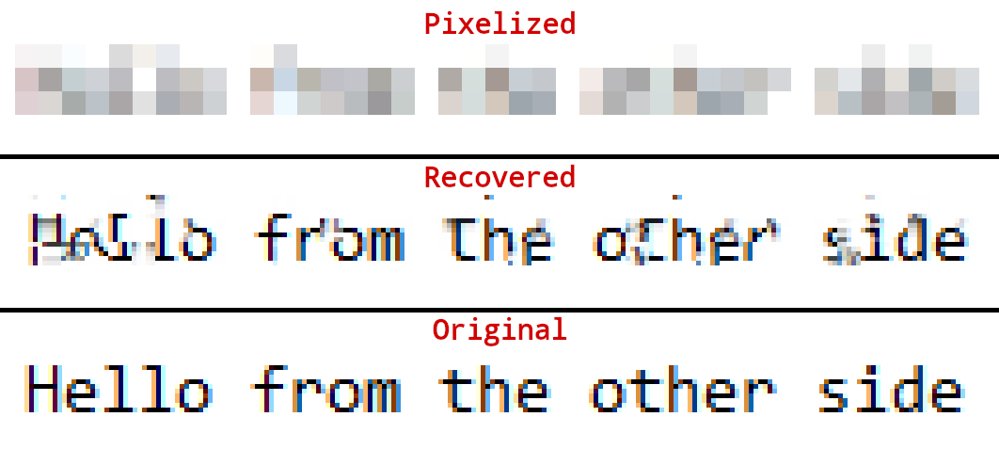
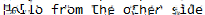
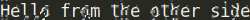

# 🔓 fork-Depix - 像素化图像还原工具


## 📖 项目简介

fork-Depix是一个像素化图像还原工具的PoC(概念验证),用于从像素化的截图中恢复原始文本。通过De Bruijn序列匹配算法,还原被马赛克处理的文字信息。

## 📦 项目来源

- **原项目**: [beurtschipper/Depix](https://github.com/beurtschipper/Depix)
- **原作者**: Sipke Meeuwesen (beurtschipper)
- **开源协议**: Creative Commons Attribution 4.0 International (CC BY 4.0)
- **Fork时间**: 2024年

## 🔧 二次开发内容

本项目为原项目的学习研究版本,未进行实质性修改,主要用于:
- 学习图像处理和模式识别算法
- 研究De Bruijn序列的应用场景
- 了解像素化编码的逆向还原原理

## ⚠️ 免责声明

本项目仅供学习和研究使用,请勿用于非法用途。使用本项目所产生的一切后果由使用者自行承担。

## 项目架构 | Architecture



## 核心算法流程 | Algorithm Flow



## 技术特点 | Technical Features

```mermaid
mindmap
  root((Depix<br/>核心技术))
    图像处理
      线性盒式滤波
      像素块检测
      边界识别
    匹配算法
      De Bruijn序列
      精确匹配
      几何验证
      迭代优化
    支持格式
      Notepad截图
      Sublime截图
      GIMP处理
      Greenshot
    工具集
      depix.py
      tool_show_boxes.py
      tool_gen_pixelated.py

This implementation works on pixelized images that were created with a linear box filter.
In [this article](https://www.spipm.nl/2030.html) I cover background information on pixelization and similar research.

## Example



## Updates

* 27 nov '23: Refactored and removed all this pip stuff. I like scripts I can just run. If a package can't be found, just install it. Also added `tool_show_boxes.py` to show how bad the box detector is (you have to really cut out the pixels exactly). Made a TODO to create a version that just cuts out boxes of static size.

## Installation

* Install the dependencies
* Run Depix:

```sh
python3 depix.py \
    -p /path/to/your/input/image.png \
    -s images/searchimages/debruinseq_notepad_Windows10_closeAndSpaced.png \
    -o /path/to/your/output.png
```

## Example usage

* Depixelize example image created with Notepad and pixelized with Greenshot. Greenshot averages by averaging the gamma-encoded 0-255 values, which is Depix's default mode.

```sh
python3 depix.py \
    -p images/testimages/testimage3_pixels.png \
    -s images/searchimages/debruinseq_notepad_Windows10_closeAndSpaced.png
```

Result: 

* Depixelize example image created with Sublime and pixelized with Gimp, where averaging is done in linear sRGB. The backgroundcolor option filters out the background color of the editor.

```sh
python3 depix.py \
    -p images/testimages/sublime_screenshot_pixels_gimp.png \
    -s images/searchimages/debruin_sublime_Linux_small.png \
    --backgroundcolor 40,41,35 \
    --averagetype linear
```

Result: 

* (Optional) You can view if the box detector thingie finds your pixels with `tool_show_boxes.py`. Consider a smaller batch of pixels if this looks all mangled. Example of good looking boxes:

```sh
python3 tool_show_boxes.py \ 
    -p images/testimages/testimage3_pixels.png \
    -s images/searchimages/debruinseq_notepad_Windows10_closeAndSpaced.png
```

* (Optional) You can create pixelized image by using `tool_gen_pixelated.py`.

```sh
python3 tool_gen_pixelated.py -i /path/to/image.png -o pixed_output.png
```

* For a detailed explanation, please try to run `$ python3 depix.py -h` and `tool_gen_pixelated.py`.

## About

### Making a Search Image

* Cut out the pixelated blocks from the screenshot as a single rectangle.
* Paste a [De Bruijn sequence](https://en.wikipedia.org/wiki/De_Bruijn_sequence) with expected characters in an editor with the same font settings as your input image (Same text size, similar font, same colors).
* Make a screenshot of the sequence.
* Move that screenshot into a folder like `images/searchimages/`.
* Run Depix with the `-s` flag set to the location of this screenshot.

### Making a Pixelized Image

* Cut out the pixelized blocks exactly. See the `testimages` for examples.
* It tries to detect blocks but it doesn't do an amazing job. Play with the `tool_show_boxes.py` script and different cutouts if your blocks aren't properly detected.

### Algorithm

The algorithm uses the fact that the linear box filter processes every block separately. For every block it pixelizes all blocks in the search image to check for direct matches.

For some pixelized images Depix manages to find single-match results. It assumes these are correct. The matches of surrounding multi-match blocks are then compared to be geometrically at the same distance as in the pixelized image. Matches are also treated as correct. This process is repeated a couple of times.

After correct blocks have no more geometrical matches, it will output all correct blocks directly. For multi-match blocks, it outputs the average of all matches.

### Known limitations

* The algorithm matches by integer block-boundaries. As a result, it has the underlying assumption that for all characters rendered (both in the de Brujin sequence and the pixelated image), the text positioning is done at pixel level. However, some modern text rasterizers position text [at sub-pixel accuracies](http://agg.sourceforge.net/antigrain.com/research/font_rasterization/).
* You need to know the font specifications and in some cases the screen settings with which the screenshot was taken. However, if there is enough plaintext in the original image you might be able to use the original as a search image.
* This approach doesn't work if additional image compression is performed, because it messes up the colors of a block.

### Future development

* Implement more filter functions

Create more averaging filters that work like some popular editors do.

* Create a new tool that utilizes HMMs

After creating this program, someone pointed me to a [research document](https://www.researchgate.net/publication/305423573_On_the_Ineffectiveness_of_Mosaicing_and_Blurring_as_Tools_for_Document_Redaction) from 2016 where a group of researchers managed to create a similar tool. Their tool has better precision and works across many different fonts.
While their original source code is not public, an open-source implementation exists at [DepixHMM](https://github.com/JonasSchatz/DepixHMM).

Edit 16 Feb '22: [Dan Petro](https://bishopfox.com/authors/dan-petro) created the tool UnRedacter ([write-up](https://bishopfox.com/blog/unredacter-tool-never-pixelation), [source](https://github.com/BishopFox/unredacter)) to crack a [challenge](https://labs.jumpsec.com/can-depix-deobfuscate-your-data/) that was created as a response to Depix!

Still, anyone who is passionate about this type of depixelization is encouraged to implement their own HMM-based version and share it.
